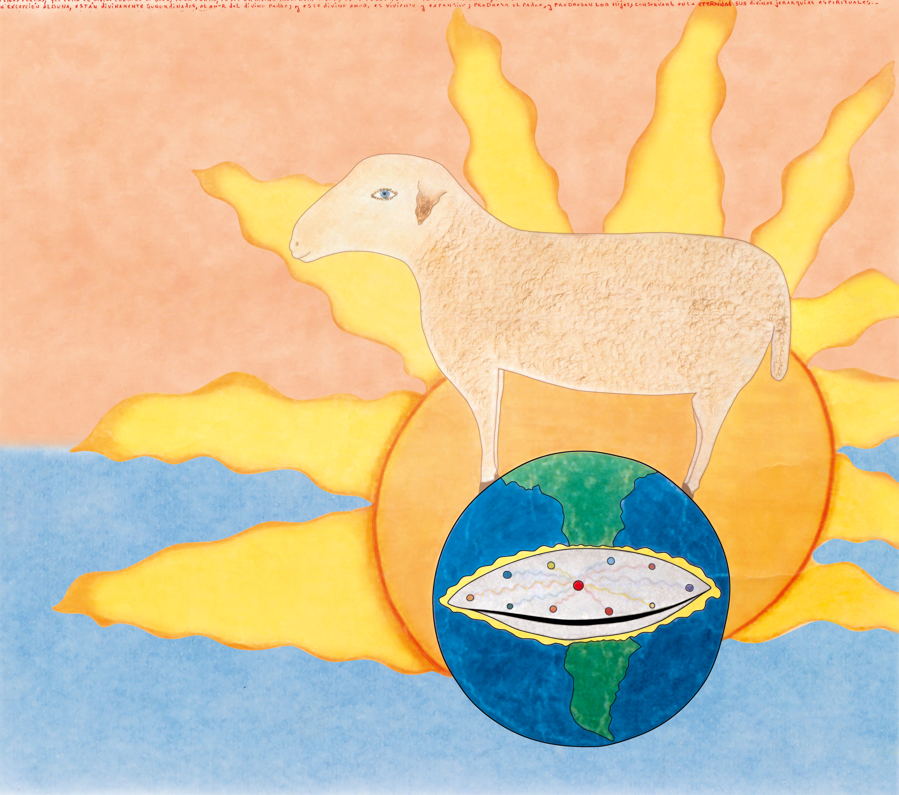
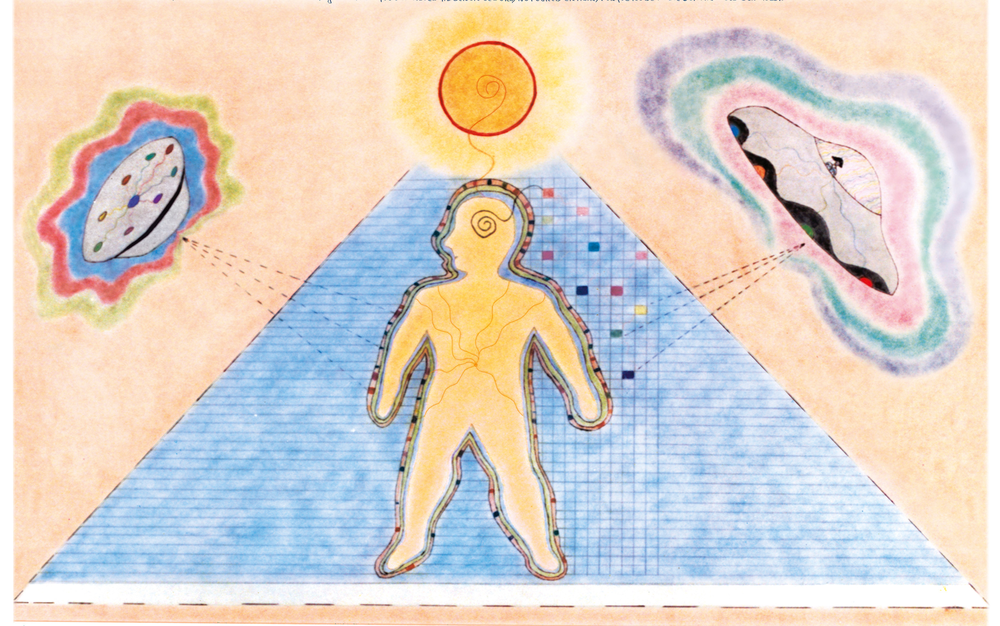
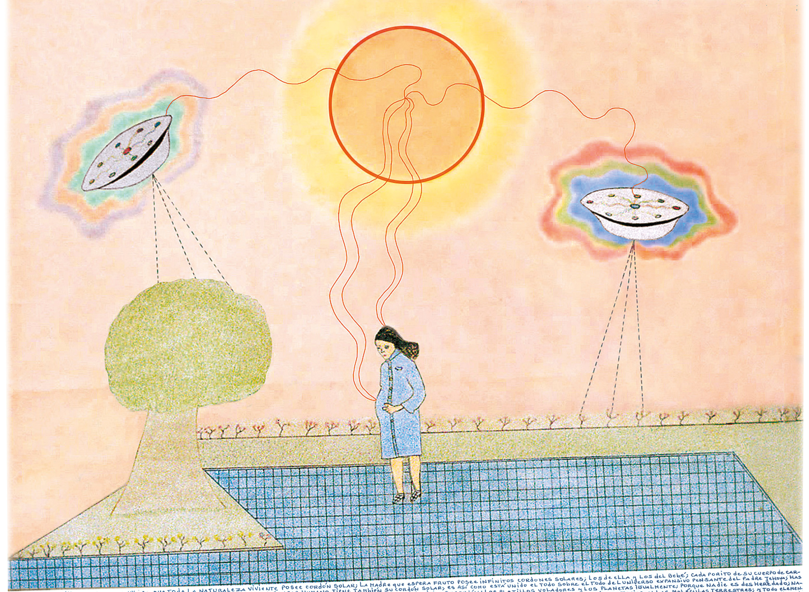
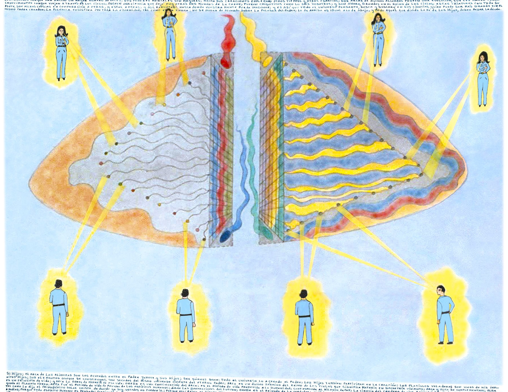
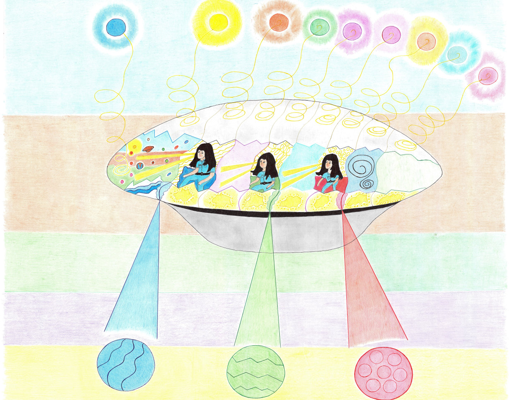
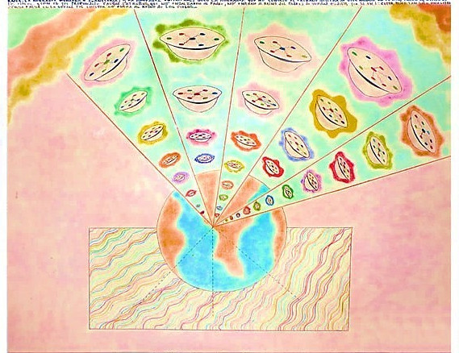
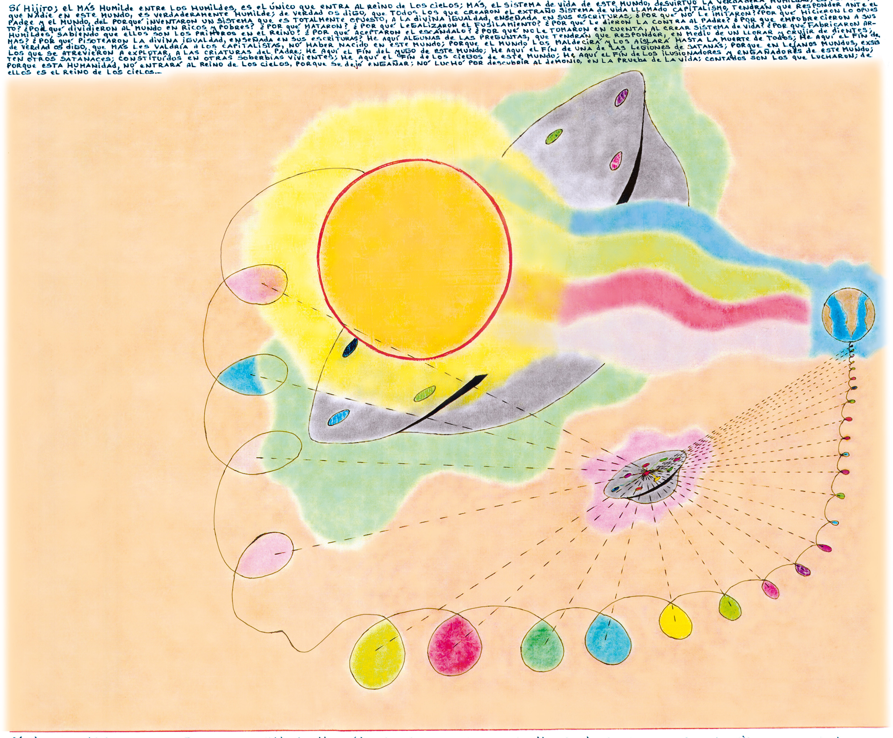
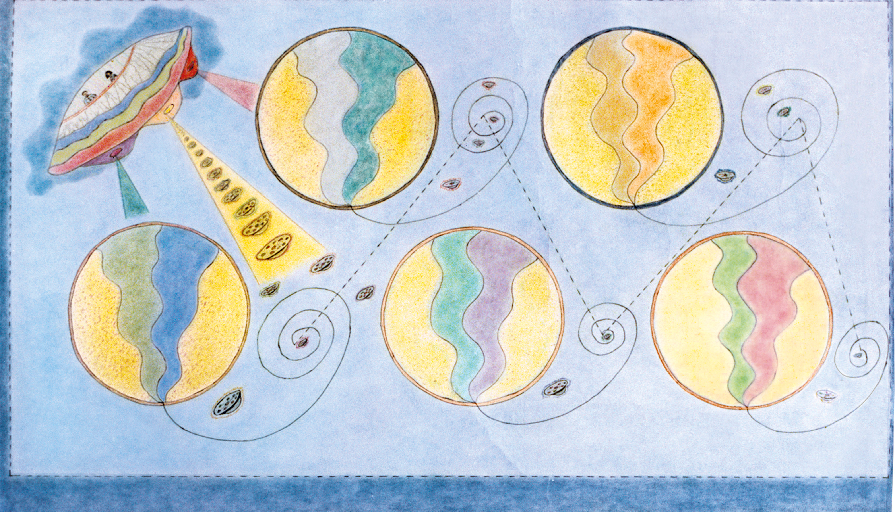
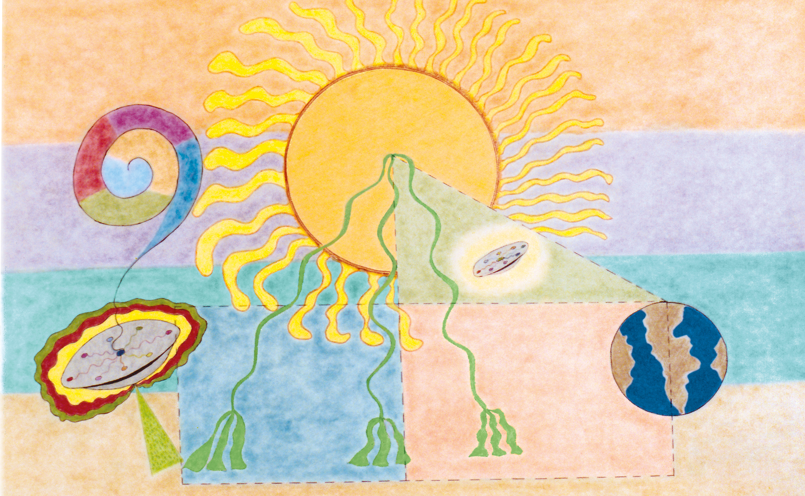
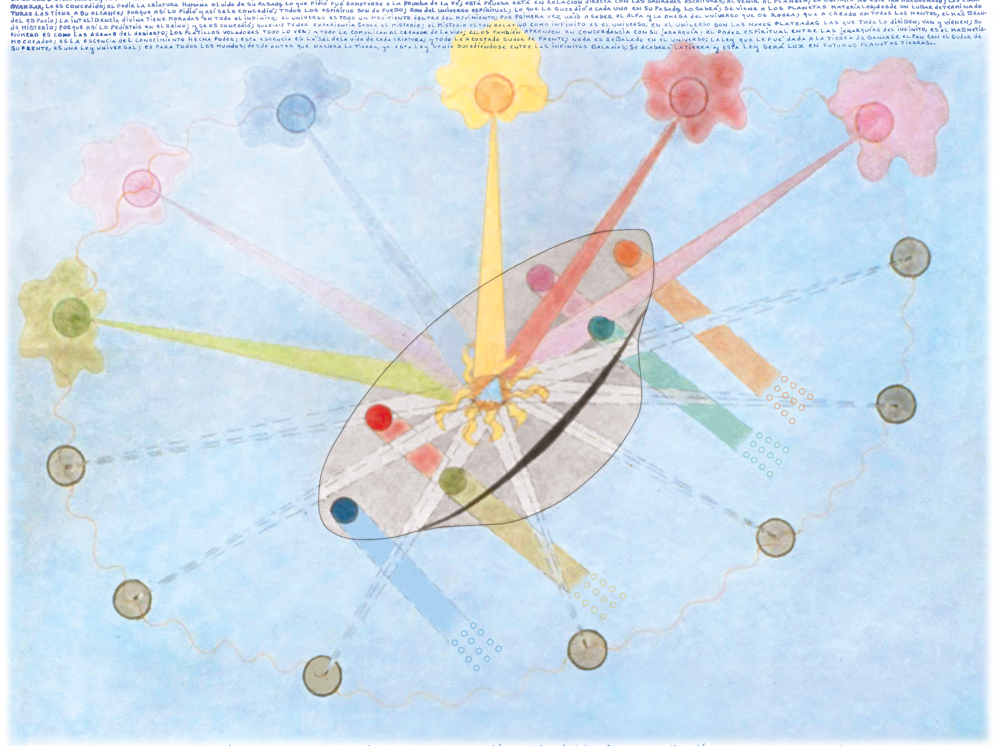

el drama humano se hizo hereditario; la bestia que representa a los más influenciados por el oro, los dividió a todos; y todos aportan mentalmente, planetas a las tinieblas; si la bestia no exsistiese, nadie aportaría planetas a las tinieblas; porque habría surgido un sistema de vida más amoroso; el drama humano vá más allá del llorar y crujir de dientes; éste ocurre en un presente; los planetas generados en el reinado de la bestia, incluyen infinitos futuros presentes; que son otros tantos llorares y crujires de dientes; porque en cada idea que se generó, iba la extraña semilla de la bestia; semilla que por la ley de la expansión, llegará a ser planeta; en todo instante esta ley se cumple, desde los doce años de edad; los niños generan planetas de inocencias; sus ideas son microscópicos reinos; la bestia en todo instante los corrompe con su extraño complejo de la posesión; del oro; todo llamado adulto que corrompió a la inocencia, se expondrá a la ira de Jehova-Padre; muchos les inculcan desde pequeños, el comercio; sabiendo que ningún comerciante entra al Reino de los Cielos; los tales tendrán divino juicio por corromper a los inocentes de Dios; a los corruptores de niños, más les valdría no haber nacido; en las jerarquías solares, ellos al separar las ideas de la luz, de las ideas de las tinieblas, separan también las ideas de los niños; el fruto de los bienaventurados; un fruto que dará lugar a futuros mundos de inocencia; ó a futuros mundos de la fantasía viviente;

Así es hijito; el color está en lo material y en lo espíritual; porque la criatura es carne y es mente; y la carne y la mente, se influyen mutuamente; lo que entra por los ojos, queda impregnado en el todo sobre el todo de la criatura; llamaré hijito a tres ingenieros celestiales; ¡Oh! ¿Cómo se aparecieron en forma tan instantánea? Fué hijito un llamado telepático; fué tal como te llamé a Tí, hace ya tantos años terrestres; Así lo recuerdo divino Padre Jehova; jamás podré olvidarlo; Alabado seas Creador del universo; estamos a tus divinas órdenes dicen los ingenieros celestiales; Sí hijos del Reino; les presento a un Hijo Primero del lejano planeta Tierra; ¿Planeta Tierra? preguntan los ingenieros celestes; no conocemos ningún planeta Tierra, divino Padre Jehova; Lo sabía hijitos; la Tierra es planeta polvo; pertenece a la galaxia Trino; es un mundo de la carne; posee como compañero a un sol enano de color amarillo-pálido; ¡Que interesante divino Padre Jehova; siempre fascinan los mundos desconocidos; Así lo leo en vuestras celestiales mentes hijos; preséntate hijo primero de la Tierra; Así sea divino Padre Jehova; hágase en Mí, tu divina voluntad; hermanos del Reino, soy Luis Antonio por la divina gracia del divino Padre Jehova; pertenezco al planeta Tierra; planeta de vida de prueba; con olvido de su lugar de orígen; Bienvenido seas hermano terrenal; somos ingenieros espaciales; nos presentaremos: Soy el ingeniero Paz; Y yo el ingeniero Dulcíneo; Y yo soy el ingeniero Celeste; nos a interesado mucho saber de tu mundo; todo lo que interesa a nuestro Creador eterno, es importante para nosotros; Y para Mí igualmente hermanos celestiales; Pediremos al divino Padre Jehova, nos enseñe tu planeta Tierra, por la divina television solar; Veo que estás asombrado hijito; Así es divino Padre Jehova; ¿Qué es la divina television solar? La television solar es esto; ¡Oh! ¡La Tierra! ¡el sistema solar que la rodea! ¡Que gigantesca y hermosa television de colores! Así es hijito; esta divina television es salida de los propios elementos del universo; y no tiene fín; jamás lo tendrá; te contaré hijo que esta divina television, fué anunciada también en tu planeta Tierra; en mi divino evangelio que fué dado al mundo de la prueba dice: el libro de la vida; ¡Que fascinante revelación divino Padre Jehova! Así es hijo primero; la television solar es una de las maravillas del universo; en los planetas de prueba, como lo es tu Tierra, esta television nace de los mismos elementos de la naturaleza; todo cuanto se hizo durante la vida, está registrado en esta television solar; los platillos voladores también poseen la television solar; ellos sus tripulantes, son conocidos como los Padres Solares; hijos mayores del cosmos, subordinados a la divina Trinidad en el Padre Jehova; porque así como hay padres humanos en la Tierra, hay también padres solares fuera de la Tierra; lo de arriba es igual a lo de abajo; y te diré hijo, que todo padre solar, fué también criatura humana, en mundos tan antiguos, que éstos ya no se encuentran en el espacio; ellos también fueron criaturas de carne; porque el principio humilde, es para todos; quien no fué humilde y microscópico, no llega a ser grande en el Reino de los Cielos; esto significa que ningún planeta es único en la creación; antes del nacimiento de cada planeta, hubieron infinitos otros; el saber quien fué el primero, es la eterna búsqueda de todos los que pertenecen, al universo expansivo pensante; hijitos, os dejaré por un instante celestial; que los divinos ingenieros celestes, instruyan al hijo terrestre; estaré en otros soles; Hágase tu divina voluntad, Padre Jehova; Veo que los padres solares, al saludar al Eterno, lo hacen levitando; Hijo terrestre, puedes preguntar lo que gustes; son órdenes divinas, el instruírte; Gracias eternas divinos padres solares; ¿Por qué levitáis? Veo que aquí en el Reino de los Cielos, no se conoce el dar la mano, como una forma de saludo; Así es hermano terrestre; en los lejanos planetas nacen muchas costumbres; aquí en el Reino como lo puedes apreciar, no se dá la mano; esto se debe hijo, a que al leerse todos la mente, nace otra psicología viviente, en la eternidad del Reino; Veo que cuando levitáis, os colocáis la mano izquierda sobre el corazón; ¿Que significa ello; el Saludo Celestial hijo, representa un respeto al todo sobre el todo, de sí mismo; el colocar la mano sobre el corazón, es saludar por igual, a todas las virtudes de nuestro pensar; en el Saludo Celestial, la propia individualidad, deja de ser importante; porque la psicología celestial enseña que la individualidad, se vá transformando, a medida que el espíritu pensante, vá conociendo sucesivas y eternas exsistencias; el pensar celestial, no se detiene ni un instante, en sí mismo; vemos hijo, que estás absorto pensando en los orgullosos de tu planeta Tierra; Así es hermanos celestiales; siempre me he preguntado, de donde los orgullosos, sacaron tan extraña influencia; Te lo diremos hijo; el orgullo pertenece a las tinieblas; que son otras regiones del universo, que ningún hijo de los universos de la luz, se atrevería a penetrar; los espíritus orgullosos de tu mundo, vivieron en las tinieblas; vivieron muchas exsistencias en ellas; aún les queda algo de la influencia de las tinieblas; ocurre hijo, que a medida que el espíritu pide magnetizaciones de vidas, las extrañas influencias de las tinieblas, se van debilitando; a los orgullosos de tu mundo, les falta aún vivir más; esto ocurre con toda imperfección, que dificulta la evolución del espíritu; es por eso, que es necesario volver a nacer de nuevo; el espíritu que no pide al divino Padre Jehova, volver a conocer alguna forma de vida, se detiene en su progreso y termina aburriéndose; ¡Que divina y sencilla lógica! pero hermanos celestiales, ¿Quién creó las tinieblas? ¿ó de dónde surgió el mal? el mal hijo, surge de los mismos hijos; es una consecuencia del libre albedrío del espíritu; sucede que cuando los hijos, han vivido mucho, logran ganar grandes ciencias creadoras; y teniendo grandes poderes, se vuelven soberbios y orgullosos; al grado tal, que desafían al mismo Creador de todas las cosas; es lo que sucedió con Luzbella; más conocido en tu mundo, como satanás; has de saber hijo terrestre, que toda idea mental que genera la mente, no muere físicamente hablando; las ideas mentales sean buenas ó malas, germinan en el espacio; y de cada microscópica é invisible idea, nace un microscópico planeta; es decir, que todos los hijos del universo, tenemos la herencia creadora del divino Padre Jehova; el divino Padre crea en forma colosal, y sus hijos en forma microscópica; todo planeta fué idea mental; y todo planeta al germinar su idea mental primera, nace de lo invisible hacia lo visible; es decir que todo mundo, pasa por infinitos tamaños; es así que tu planeta Tierra, tuvo un tamaño semejante a la cabeza de un álfiler; fué si se quiere, una bolita, una pelotita de pin-pon, una pelota de fútbol, una pelota de playa, hasta llegar a la actual bola terrestre; ¡Que fascinante y que grandiosa sencillez, para explicar lo colosal! Así es hijo terrenal; con la más grande sencillez y con lo más elemental, que la mente pueda imaginar, el Creador de todas las cosas, explica lo más difícil y lo que es imposible de explicar, en las microscópicas ciencias de sus hijos; Ahora comprendo hermanos celestiales, el porqué en mi planeta Tierra, los sabios no han podido dar con el orígen del planeta; ¡no tomaron en cuenta lo microscópico! ¡no pensaron en lo de adentro! ¡no fueron igualitarios en sus búsquedas mentales, para con la materia y para con el espíritu! Así es hijo terrestre; ¡Que inmenso fuego de colores veo! ¡es el divino Padre Jehova! ¡Que colosal! ¡Los soles gigantescos se ven ante su divina presencia, más pequeños que la cabeza de un álfiler! Así es hijo; el divino Padre es único; sus divinas formas no tienen límite conocido; Acerquémonos dice el ingeniero celestial Dulcíneo; que es de los tres el de mayor jerarquía galáctica; ¡Alabado seas divino Padre eterno! Y Yo el hijo terrenal, digo igual; me inclino y colocó mi mano izquierda, sobre el corazón; y siento en ese supremo instante, algo así como una dulce descarga eléctrica, que recorre todo mi cuerpo; y siento que un dulce sueño, se apodera de Mí; más, no me duermo; desde lejanas galaxias, hijos os he estado escuchando; dime hijo terrenal, lo último que conversabas con los ingenieros celestiales, ¿no te recuerda nada?

sí hijo divino; así es y así será por los siglos de los siglos; sí hijito; así es; no quedará piedra sobre piedra, del maldito edificio filosófico, de la maldita nobleza terrestre; lágrimas de sangre llorarán; pues nadie les tenderá la mano; muchos se suicidarán; maldecirán haber sido nobles; pues nadie querrá tener amistad con un maldito, que sólo espera para ser juzjado; mientras que mis humildes, recorren en hermosísimas naves plateadas, las galáxias del infinito; pues todo aquél que se ha ganado la divina resurrección de la carne, niño será; y como niño entrará en mi divina morada; pues escrito fué, que los niños serían los primeros, en el divino Reino de los Cielos; sí hijo divino; así es y así será por los siglos de los siglos; esto significa que sólo un niño puede lanzar la primera piedra; pues es más puro, frente a las maldades del mundo; su divina filosofía angelical, arrastra con todas las demás filosofías, que sólo fueron roca de egoísmo humano; sí hijo divino; así es y así será por los siglos de los siglos; es por eso que nadie osará tocarte hijo divino; nadie osará lanzarte la primera piedra filosófica de su propio pensamiento; pues toda divina filosofía humana, desaparece en la divina presencia, de tu propio y divino poder solar; pues los divinos querubínes, que rodean tu divino cuerpo, leen todo pensamiento humano; pues ellos saben en su divino libre albedrío, que ninguna filosofía humana, debe sobrepasarse en su propia y divina escala espíritual; quien lo haga, sólo tinieblas encuentra; sólo confusión encuentra su mente; tal como le ocurrió al divino Judas; pero Judas obró por ignorancia basada en la total ausencia de ilustración;

