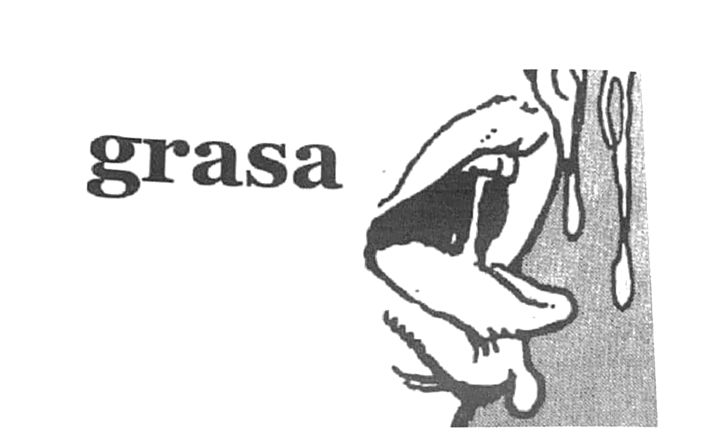

dijeron: \
al menor movimiento o amague de fuga serán \
castigados puestos como se debe en la más \
descendente categoría \
fue todo así tan irreal tan de repente \
cada cual aferrado a su estilo marcaba el espacio \
cada cual como más le agradaba ponía la pausa \
para muchos fue extraño fue negro fue raro \
fue la visión a la escala más símil que he visto \
de un santo \
fue todo así tan de verdad tan de repente \
un plano perfecto ya hecho instalado prefijo \
visto de antes era una encuentro tal como un \
choque era un zarpazo tipo rescate fue todo \
así tan de improviso \
incluso la puerta chiquita por donde llegaron \
era un atajo directo a la zona vacía la que \
indicaba la tan esperada penúltima opción \
amarilla la que nos daba respiro la única \
auténticamente elegida por todos para el escape

hay alguien aquí usando una manga como \
pantalla hay alguien acá interesado en que \
vayan que busquen que traten de hallar lo que \
quieren que no se preocupen que otro jetón \
se hará responsable de lo que pasa

yo debería tener una grabadora conectada directo \
al cerebro con un par de cables en línea a un \
proyector de video y así poder registrar todo \
cuanto haya imaginado

yo debería de hacer tantas cosas \
olvidar por ejemplo olvidar el asunto pendiente \
que tanto me aflige olvidar a los miles de monos \
macacos primates de mierda sobre esta planicie \
olvidar y rezar y que ojalá todo lo dicho no tenga \
una pizca de cierto de hecho aprovecho de \
dejarles bien claro que todo es mentira \
aprovecho también de decirles que son y serán \
siempre ustedes una presión gigantesca y que \
la estupendísima criatura así como va \
me estaría dejando un sabor espantoso

[...]

aquí mismo en esta cabeza hay miles millones \
de años de historia sucede y lo reconozco es \
que tengo mala memoria y se me hace difícil \
poder transmitirla pero la tengo la tengo toda \
aquí en el pellejo escrita capa por capa bajo la \
piel

hay en el ojo brilloso un llanto hacia dentro \
hay un gueveo flotando en el aire de una \
pobreza absoluta es por eso la boca entreabierta \
cayendo saliva es por eso el dolor y el amor \
la consecuencia la poca presencia y la falta de \
todo del modo en que uno va sucediendo \
la forma como van ocurriendo los hechos la \
certeza de que no hay soledad que pueda matar \
el hastío que pueda pegarle un puntazo al \
vacío saber que todo en cierta manera amenaza \
hasta el punto de quedarse plantado de brazos \
y piernas tan sólo mirando

De _Grasa_
